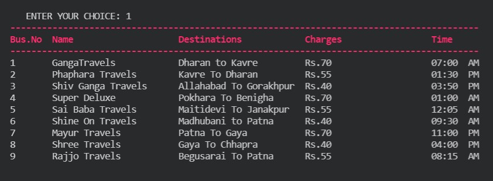
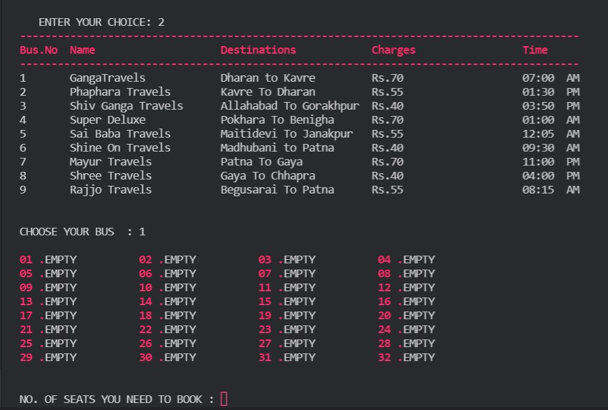
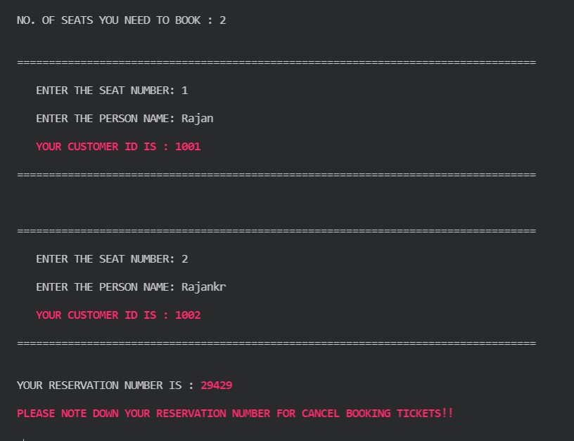
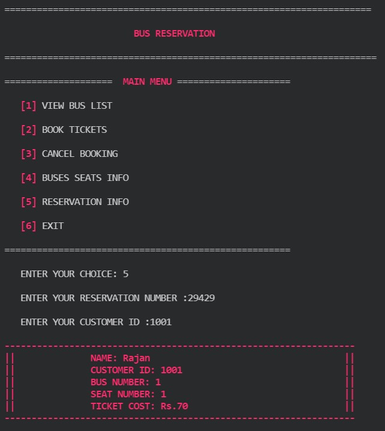

# Bus Reservation System with c language

## -> CS3401 Mini Project

## Made anlong with

### 1. [Ayushi](https://github.com/Ayushi1881)

### 2. [Payal bharti](https://github.com/Payal1bharti)

### 3. [Archana ](https://github.com/arc2001)

### 4. [Poonam Safi](https://github.com/pnmsafi)

### 5. [Rajneesh kr.](https://github.com/rajneesh1002)

### 6. [Rajan kr.](https://github.com/krcpr007)
## HERE ARE FEW SNAPSHOTS OF OUTPUTS

 
 

 
 

 
 

 
 

`Happy code <3`
